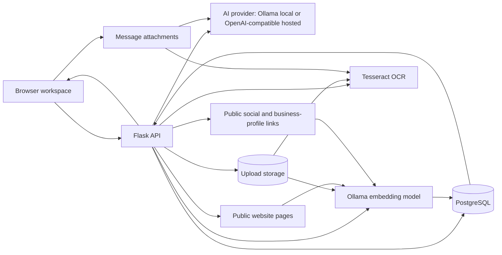

# AI Studio

AI Studio is a portfolio-quality AI workspace built with Flask, PostgreSQL, OCR, retrieval-augmented generation, and a hybrid AI provider layer. It supports local Ollama models for development and a hosted OpenAI-compatible provider for public demos. It supports streaming chat, reusable knowledge libraries, source citations, multiple response styles, persistent conversation history, and a compact professional interface.

## Highlights

- Hybrid AI provider support: local Ollama or hosted OpenAI-compatible demo mode
- Local Ollama model selection
- Streaming responses with stop and regenerate controls
- Markdown, syntax highlighting, and copy controls
- Single, detailed, creative, precise, fast, and three-option modes
- Secure local user accounts with per-user chat and knowledge isolation
- PostgreSQL chat and message history
- Pin, favorite, archive, folder, tag, bulk-select, search, export, and delete chat workflows
- Chat-specific documents, reusable global files, crawled website pages, social sources, and Google Business Profiles
- ChatGPT-style message attachments with drag-and-drop and clipboard screenshot paste
- Vision-model image analysis with OCR and automatic Ollama vision fallback
- PDF, DOCX, TXT, PNG, JPG, JPEG, and WebP ingestion
- OCR fallback for scanned PDFs and images
- Embedding-based retrieval across files and websites with source excerpts and relevance scores
- Strict document-only answers to reduce unsupported claims
- Persistent generation settings and light/dark themes
- Per-user workspace backup and additive restore
- Health endpoints, structured logs, security headers, and migrations
- Automated pytest coverage and GitHub Actions CI
- Docker Compose packaging with PostgreSQL and optional Ollama

## Compact workspace

The main screen reserves most of the viewport for reading and writing:

- a slim model and settings toolbar
- a compact knowledge summary bar
- a right-side knowledge drawer for uploads and selection
- a large chat area
- a fixed input area

The knowledge drawer is closed by default, remembers its most recent state, and now has an independent full-height scroll area. Chat and global knowledge selections continue to work while the drawer is closed.

## Architecture



More detail is available in `docs/ARCHITECTURE.md`.

## Local development

### Requirements

- Python 3.12+
- PostgreSQL
- Ollama
- Tesseract OCR

### Install

```powershell
python -m venv .venv
.\.venv\Scripts\Activate.ps1
python -m pip install --upgrade pip
python -m pip install -r requirements-dev.txt
```

Copy the example environment file:

```powershell
Copy-Item .env.example .env
```

Update `.env` with the local PostgreSQL password, Ollama URL, secret key, and Tesseract path.

For local Ollama mode, keep:

```env
AI_PROVIDER=ollama
OLLAMA_URL=http://localhost:11434
```

For a public portfolio demo, use a hosted provider instead:

```env
AI_PROVIDER=openai
OPENAI_API_KEY=your-api-key
OPENAI_MODEL=gpt-4o-mini
```

Apply all database migrations:

```powershell
python -m flask --app app:create_app db upgrade
```

Create the first administrator and assign existing chats and knowledge sources to that account:

```powershell
python -m flask --app app:create_app bootstrap-owner
```

Do not use `db stamp` for this release. Migrations through `20260628_0005` create user ownership and chat-organization schema.

Start development mode:

```powershell
python app.py
```

Open `http://127.0.0.1:5000`.

## Secure user accounts

AI Studio now requires a local account by default. Each user receives separate chats, chat documents, global uploaded files, website memberships, and social-source memberships. Public website and social content may be cached once, while access to each source is controlled per workspace.

The first installation step after migration is:

```powershell
python -m flask --app app:create_app bootstrap-owner
```

Additional accounts can be created from **User administration** or through:

```powershell
python -m flask --app app:create_app create-user
```

Password recovery for a local account is available through:

```powershell
python -m flask --app app:create_app reset-user-password
```

Public registration is disabled by default. Set `ALLOW_REGISTRATION=true` only when self-service registration is required. See `AUTHENTICATION_WORKSPACE_SETUP.md` for migration, account, Docker, and recovery instructions.


## Chat organization and workspace backup

Open **Organize** under the chat search box to switch between Active, Favorites, Archived, and All views. Chats can be filtered by folder or tag, moved by drag-and-drop, and changed in bulk. Archiving hides a chat from the normal view without deleting it.

The sidebar account menu now includes **Download workspace backup** and **Restore workspace backup**. Backups are per-user ZIP files containing chats, messages, folders, tags, uploaded documents, attachment files, global documents, and indexed website/social metadata and chunks. Passwords, cookies, `.env`, and database credentials are excluded. Restore is additive and does not overwrite existing workspace data.

Apply migration `20260628_0005` before using these features. See `CHAT_ORGANIZATION_BACKUP_SETUP.md`.

## Website knowledge sources

Open **Knowledge Sources → Manage → Global Library**. You can index one public page with **Add page**, or enter a homepage and choose **Discover site**. The crawler checks `robots.txt`, reads sitemap locations when available, follows same-domain links up to the selected depth, and shows a page preview before indexing.

```text
https://example.com
```

Discovered pages can be selected individually. Indexed pages are grouped by domain, with controls to refresh or delete the complete website group. Login, checkout, account, admin, search, downloadable-file, localhost, private-network, reserved, and link-local URLs are excluded. Page citations open the exact indexed URL.

Crawler limits are controlled through the `WEBSITE_CRAWLER_*` environment settings. This release reuses the existing website tables, so it does not require a new database migration.


## Chat attachments and vision

Use the paperclip beside the prompt, drag files onto the composer, or paste a screenshot from the clipboard. Message attachments support PDF, DOCX, TXT, PNG, JPG, JPEG, and WebP.

Documents and PDFs use extraction, OCR, chunking, and embeddings. Images are sent directly to the selected Ollama model when it supports vision. When the selected model is text-only, AI Studio searches installed Ollama models for a vision-capable fallback. Set `VISION_MODEL` in `.env` to make that choice predictable.

Attachments are saved with the user message, shown again when the chat is reopened, and removed from storage when the chat is deleted.

## Social and Google Business Profile knowledge sources

Open **Knowledge Sources → Manage → Global Library → Social & business profiles**. Supported URL families include Facebook, Instagram, X/Twitter, TikTok, LinkedIn, YouTube, Threads, Bluesky, Google Maps, and Google Business Profile links.

AI Studio first attempts a normal public-page import. A `202` response means the application is healthy but the platform did not expose readable public HTML. Use **Open source**, copy the visible About text, caption, description, post text, or business details, then use **Paste from clipboard** and **Index pasted content**. The original link remains the citation.

Google Business Profile automatic import uses the official Google Places API. Add a restricted `GOOGLE_MAPS_API_KEY` to `.env`, enable Places API in the Google Cloud project, and keep billing and API restrictions configured. Without a key, the same manual pasted-content workflow remains available.

This feature does not request social passwords, bypass login screens, or synchronize private account data. Public social imports remain best-effort because platform access rules differ.

After installing this release on an existing database, run:

```powershell
python -m flask --app app:create_app db upgrade
```

See `ATTACHMENTS_SOCIAL_SOURCES_SETUP.md` for complete installation and testing steps.

## Production mode on Windows

Set these values in `.env`:

```env
APP_ENV=production
AUTO_CREATE_DATABASE=false
HOST=127.0.0.1
PORT=5000
WAITRESS_THREADS=8
```

Run migrations and start Waitress:

```powershell
python -m flask --app app:create_app db upgrade
python serve.py
```

## Docker Compose

Copy the Docker environment template:

```powershell
Copy-Item .env.docker.example .env.docker
```

Set a URL-safe PostgreSQL password and a long random secret, then run:

```powershell
docker compose --env-file .env.docker up --build -d
```

The default stack runs AI Studio and PostgreSQL in containers and connects to Ollama on the host through `host.docker.internal`.

For Render or another public demo environment, set `AI_PROVIDER=openai` and configure `OPENAI_API_KEY`.

For the optional containerized Ollama service:

```powershell
docker compose `
  --env-file .env.docker `
  -f compose.yaml `
  -f compose.ollama.yaml `
  up --build -d
```

See `docs/DOCKER.md` for model-pull commands, logs, volumes, and shutdown instructions.

## Testing

```powershell
python -m pytest
```

Coverage output:

```powershell
python -m pytest --cov=. --cov-report=term-missing
```

Syntax checks:

```powershell
python -m compileall -q .
Get-ChildItem static\js\*.js | ForEach-Object { node --check $_.FullName }
```


## Social sources and blocked platforms

AI Studio first attempts to read a public social-media URL. Platforms such as LinkedIn, Facebook, and Instagram may block automated reading or require login. When that happens, the manual fallback opens automatically:

1. Keep the original social URL in the URL field.
2. Copy the visible About text, caption, description, or post content.
3. Paste it into **Visible social content**.
4. Click **Index pasted content**.

The pasted text becomes searchable knowledge while the original social URL remains the citation. AI Studio never asks for a social-media password.

The light theme includes high-contrast primary, secondary, disabled, tab, status, and source-management controls. The main **AI Assistant** title uses a responsive neon gradient in both themes.

See `SOCIAL_ACCESSIBILITY_BRANDING_SETUP.md` for installation and validation.

## Voice chat

AI Studio includes browser-based two-way voice controls:

- Microphone speech-to-text beside the attachment button
- Live transcript inserted into the prompt before sending
- Automatic assistant read-aloud toggle
- Read-aloud controls on saved and newly generated responses
- Read controls on option cards
- Browser capability and permission error handling

Voice input works best in current Microsoft Edge or Google Chrome. Microphone access is available on localhost and normally requires HTTPS after deployment. Depending on the browser, speech recognition may use the browser vendor's speech service; audio is not sent to the AI Studio Flask backend.

See `VOICE_CHAT_SETUP.md` for usage, browser support, privacy notes, and testing.

## Health and maintenance

- Liveness: `/api/health/live`
- Readiness: `/api/health/ready`
- Detailed health: `/api/health`
- OCR status: `/api/ocr/status`

List orphaned uploaded files:

```powershell
python -m flask --app app:create_app cleanup-uploads
```

Delete confirmed orphaned files:

```powershell
python -m flask --app app:create_app cleanup-uploads --delete
```

## Repository structure

```text
AI-Chat-App/
├── app.py
├── config.py
├── serve.py
├── wsgi.py
├── Dockerfile
├── compose.yaml
├── compose.ollama.yaml
├── database/
├── migrations/
├── routes/
├── services/
├── static/
├── templates/
├── tests/
├── docs/
└── .github/workflows/ci.yml
```

## Screenshots

Before publishing, add sanitized screenshots under `docs/images/` and update this section. Avoid showing private CVs, customer files, credentials, usernames, or local filesystem paths.

Recommended screenshots:

- Compact dark workspace
- Knowledge drawer
- RAG response with citations
- Light theme
- System health popover

## Security and privacy

AI Studio is designed for local operation, but security still depends on deployment choices:

- Never commit `.env` or `.env.docker`.
- Use a strong `SECRET_KEY`.
- Use HTTPS before enabling HSTS.
- Keep Ollama and PostgreSQL inaccessible from untrusted networks.
- Review uploaded content before sharing screenshots or database backups.
- Keep authentication enabled and use HTTPS before exposing the application publicly.

## Documentation

- `FINAL_WORKSPACE_DOCKER_GITHUB_SETUP.md`
- `ATTACHMENTS_SOCIAL_SOURCES_SETUP.md`
- `ATTACHMENTS_SOCIAL_VALIDATION_REPORT.md`
- `VOICE_CHAT_SETUP.md`
- `VOICE_CHAT_VALIDATION_REPORT.md`
- `SOCIAL_ACCESSIBILITY_BRANDING_SETUP.md`
- `SOCIAL_ACCESSIBILITY_BRANDING_VALIDATION_REPORT.md`
- `PROMPT_LIBRARY_BRANCHING_SETUP.md`
- `PROMPT_LIBRARY_BRANCHING_VALIDATION_REPORT.md`
- `docs/ARCHITECTURE.md`
- `docs/DOCKER.md`
- `docs/GITHUB.md`
- `docs/RENDER_DEPLOYMENT.md`
- `docs/PORTFOLIO_RELEASE.md`
- `RELEASE_CHECKLIST.md`

## License

Choose and add a license before making the repository public. No license is included automatically because licensing is a project-owner decision.

## Prompt library and conversation branching

AI Studio includes a per-user prompt library for reusable instructions. Open it from the composer toolbar to create, search, categorize, favorite, edit, copy, and insert prompt templates.

Messages include branching controls:

- **Branch** copies the conversation through the selected message into a new chat.
- **Edit in branch** creates a branch before a selected user message and places that text in the composer for revision.

The original conversation is never overwritten. Branch metadata and prompt templates are included in workspace backups.

The desktop layout also uses a tighter shared message rail on wide displays, while half-window and mobile layouts remain responsive. Sidebar chat rows expose one compact action menu, with favorite and pin state shown as small badges.

See `PROMPT_LIBRARY_BRANCHING_SETUP.md` and `PROMPT_LIBRARY_BRANCHING_VALIDATION_REPORT.md`.

## Admin analytics, reliability, and accessibility

Administrators can open **Admin dashboard** from the account menu. The dashboard provides:

- Active and disabled user counts
- Chats, messages, documents, attachments, website sources, and social sources per user
- Per-user upload storage estimates
- Model request counts and average generation duration
- Recent failed requests and sampled health history
- Audit events for important account, backup, restore, and maintenance actions
- Safe orphan-upload cleanup and telemetry-retention controls

Operational analytics begin collecting after migration `20260628_0007` is installed. Request telemetry stores method, path, status, duration, request ID, and user ID where available. It does not store prompts, response text, query strings, passwords, file contents, or IP addresses.

RAG source lists are collapsed by default to preserve reading space. They remain available through a keyboard-accessible source summary and remember their open or closed state for the browser session.

The reliability layer includes process-local rate limiting for login, chat, API mutations, uploads, and restore operations. The default Waitress deployment is single-process. Multi-instance deployments should replace this limiter with a shared Redis-backed gateway or limiter.

Testing and operations documentation:

- `ADMIN_RELIABILITY_ACCESSIBILITY_SETUP.md`
- `ADMIN_RELIABILITY_VALIDATION_REPORT.md`
- `docs/TESTING_AND_ACCESSIBILITY.md`
- `docs/BACKUP_RESTORE_REHEARSAL.md`
- `requirements-e2e.txt`

### Multi-provider AI backend

AI Studio now supports a flexible provider layer:

- `AI_PROVIDER=ollama` for local Ollama development
- `AI_PROVIDER=openai` for OpenAI
- `AI_PROVIDER=openrouter` for OpenRouter
- `AI_PROVIDER=gemini` for Google Gemini
- `AI_PROVIDER=anthropic` for Anthropic Claude

For the public Render portfolio demo, the recommended setting is `AI_PROVIDER=gemini` with `GEMINI_API_KEY`. Ollama remains available locally. See `docs/AI_PROVIDERS.md` for full configuration details.

