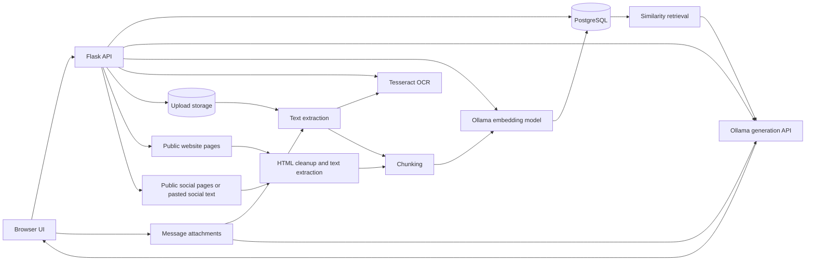

# Architecture

AI Studio is a Flask application that combines local model inference, PostgreSQL persistence, OCR, and retrieval-augmented generation.

## Main layers

- `templates/` and `static/`: browser workspace, streaming responses, settings, document management, and citations.
- `routes/`: HTTP endpoints for chat, models, health, documents, exports, and chat management.
- `services/`: Ollama calls, embeddings, OCR, RAG, logging, health checks, and file cleanup.
- `database/`: SQLAlchemy models and CRUD operations.
- `migrations/`: Alembic database schema history.
- `tests/`: route and security regression tests.

## Knowledge scopes

- **Chat documents** belong to one conversation.
- **Global documents** are reusable across conversations.
- **Website sources** are indexed public pages reusable across conversations.
- **Social sources** are indexed supported social URLs or user-supplied visible social text, reusable across conversations.
- **Message attachments** belong to a user message and can supply OCR/RAG text or direct vision-model images.
- The browser sends selected chat-document, global-document, website-source, social-source, and message-attachment IDs with each request.
- The backend retrieves the highest-scoring chunks and returns source metadata with the streamed answer.

## Runtime modes

- Local development: Flask development server and an existing local PostgreSQL/Ollama setup.
- Local production: Waitress with PostgreSQL and local Ollama.
- Docker Compose: Flask/Waitress and PostgreSQL in containers, with either host Ollama or the optional Ollama Compose service.

## Authentication and workspace boundaries

AI Studio uses Flask-Login for authenticated sessions and Flask-WTF for CSRF protection. The application-level request guard keeps health and sign-in endpoints public while requiring authentication for chat, knowledge, export, attachment, crawler, and administration routes.

Workspace ownership is enforced in database queries rather than only in the interface:

- `chats.user_id` owns chat history, chat documents, messages, and message attachments.
- `global_documents.user_id` owns reusable uploaded knowledge.
- `user_website_sources` and `user_social_sources` provide per-user memberships while allowing the extracted public content to be cached once.
- Administrative account management is separated from normal account settings.

Existing pre-authentication records are left unowned by migration `20260628_0004`. The `bootstrap-owner` command creates the first administrator and claims those legacy records without deleting or re-indexing them.

## Knowledge drawer layout

The drawer is a fixed-height flex column. Its header, scope switches, and tabs are non-scrolling controls. `.knowledge-drawer-content` is the only primary vertical scrolling region and uses `min-height: 0`, `overflow-y: auto`, overscroll containment, and touch momentum scrolling. Long document, website, crawler, and social sections therefore remain reachable without moving the underlying chat workspace.

## Prompt templates and conversation branches

`prompt_templates` stores reusable instructions per authenticated user. Prompt CRUD and usage tracking are exposed through `routes/prompt_routes.py`, while the browser drawer is implemented in `static/js/prompts.js`.

Conversation branches remain normal `chats` records. `parent_chat_id` identifies the source chat and `branched_from_message_id` records the selected branch point. Branch creation copies messages through the chosen point into a new chat instead of altering the original history. `static/js/conversation.js` supplies branch and edit-in-branch message controls.

Workspace backup and restore serialize prompt templates and remap branch relationships after restored chat and message IDs are created.

## Hybrid AI provider layer

The chat route now calls `services/ai_provider_service.py` instead of binding the public demo directly to Ollama.

- `AI_PROVIDER=ollama` keeps the original local Ollama behavior.
- `AI_PROVIDER=openai` sends generation requests to an OpenAI-compatible hosted API for Render/client demos.
- `/models` returns the correct model list for the active provider.
- RAG still happens inside AI Studio before generation, so uploaded files, website sources, social sources, and prompt modes work with either provider.
- Ollama remains the default for local development and for embedding generation.

This keeps the portfolio demo clickable for clients while preserving the local-first Ollama story.
